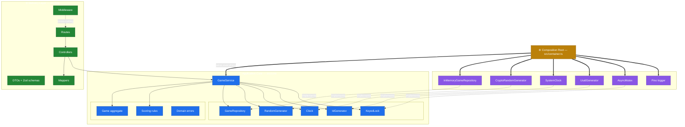
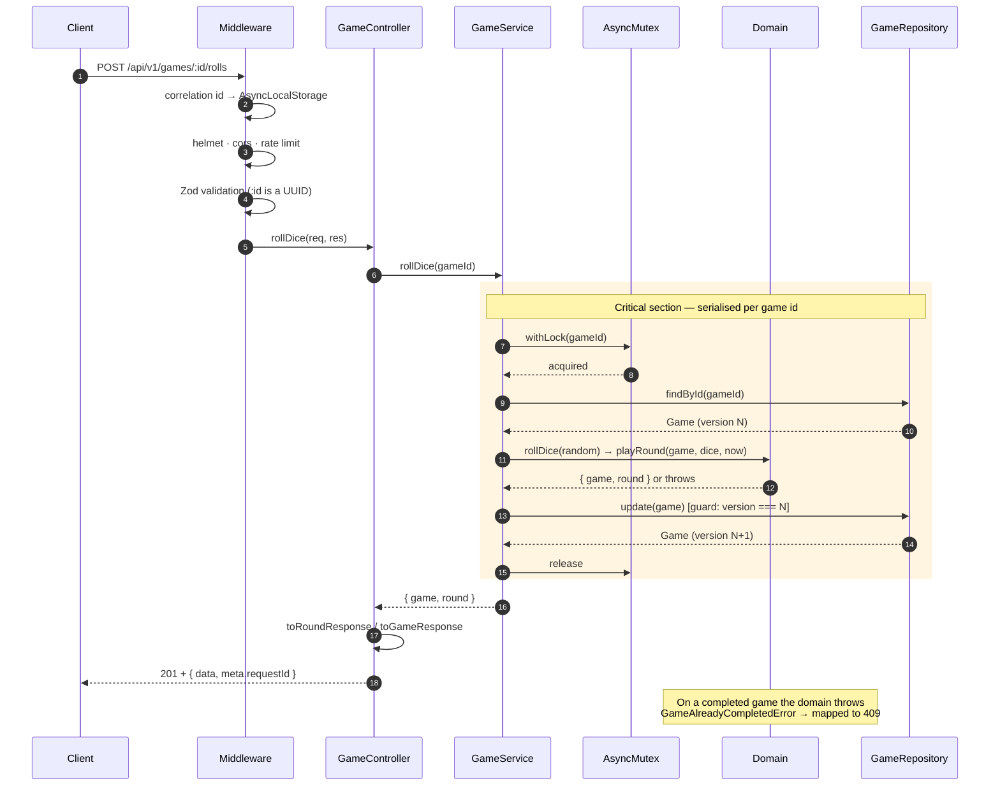
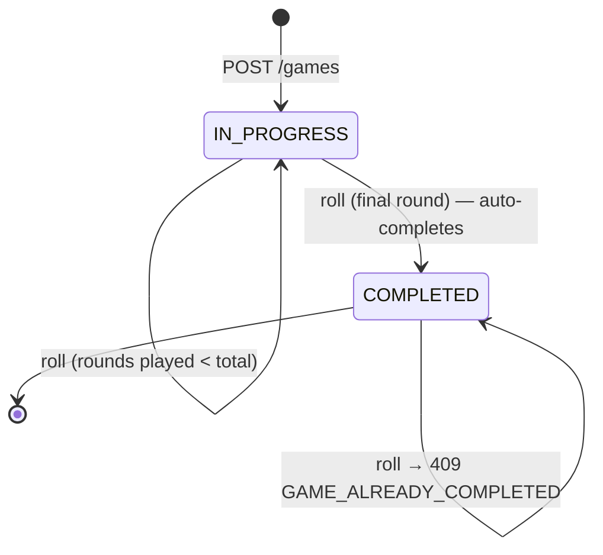
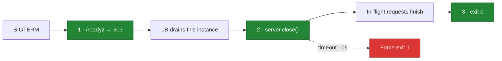
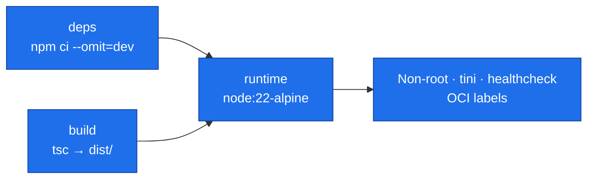

# Dice Game Service

A two-player dice game where **all game logic lives in the backend API**, with a
React frontend that only renders and dispatches. Built with **Express 4 +
TypeScript** in a ports-and-adapters architecture, authenticated, containerised,
and deployed by an immutable digest.

The game itself is small on purpose. The interesting parts are the seams: how
identity is proven, how persistence is abstracted, how concurrency is handled,
how failures surface, and how the thing gets built, verified, and deployed.

```
362 tests · 99% statement coverage · 92% branch coverage · 0 lint errors
```

### The brief, and where each requirement lives

| Requirement                                     | Where it is enforced                                                                                                    |
| ----------------------------------------------- | ----------------------------------------------------------------------------------------------------------------------- |
| 2 players, playing in rounds                    | [`pig-game.ts`](src/core/domain/pig-game.ts) — two seats bound to two identities                                        |
| Roll 2 dice as many times as you want           | [`rollDicePair`](src/core/domain/dice.ts) + `applyRoll`                                                                 |
| Each roll adds to the round score               | `applyRoll` — `currentTurnScore += d1 + d2`                                                                             |
| **6 & 6** loses the round score, turn passes    | `isBust` / `applyRoll` — a single six is an ordinary six                                                                |
| Hold: round score → global score, turn passes   | `applyHold`                                                                                                             |
| First to the winning score wins                 | `applyHold` — checked on hold only                                                                                      |
| Players can set the winning score (default 100) | `createPigGame`, `PIG_TARGET_SCORE`; frozen for the match                                                               |
| A player can start a new game at any time       | `POST /api/v1/pig-game/new-game`, allowed mid-match                                                                     |
| **API with authentication**                     | [`auth.service.ts`](src/core/services/auth.service.ts), [ADR-0007](docs/adr/0007-authentication-and-player-identity.md) |
| API manages player identities                   | `User` domain + `UserRepository`; identity only ever comes from the bearer token                                        |
| API validates turns and actions                 | `requireTurn` → `403 NOT_YOUR_TURN` / `NOT_A_PARTICIPANT`                                                               |
| Only authenticated users can create/play        | `authenticate` mounted on the router, not inside handlers                                                               |
| Both users simulated on one page                | Two independent sign-in cards, two tokens ([`App.tsx`](client/src/App.tsx))                                             |
| React app: authenticate, display, call the API  | [`client/`](client/src)                                                                                                 |
| **No game logic in the frontend**               | Enforced by design — even "was that a bust" arrives as `bustedOnLastRoll`                                               |

Optional extras implemented: **win counter per player** (#1), **local-storage
session persistence** (#2), **double-six pause + message** (#4).

---

## Table of contents

- [Quick start](#quick-start)
- [The Pig Game (full-stack)](#the-pig-game-full-stack)
- [Authentication](#authentication)
- [The guiding principle](#the-guiding-principle)
- [Architecture](#architecture)
- [Request lifecycle](#request-lifecycle)
- [Game rules](#game-rules)
- [API reference](#api-reference)
- [Concurrency: the interesting problem](#concurrency-the-interesting-problem)
- [Production readiness](#production-readiness)
- [Testing strategy](#testing-strategy)
- [Deployment](#deployment)
- [Architecture Decision Records](#architecture-decision-records)
- [What I deliberately did not build](#what-i-deliberately-did-not-build)

---

## Quick start

```bash
# Local
npm install
cp .env.example .env
npm run dev                      # http://localhost:3000

# Verify everything
npm run lint && npm run typecheck && npm test

# Docker
docker compose up --build
```

Play a game:

```bash
# Create
GAME=$(curl -s -X POST http://localhost:3000/api/v1/games \
  -H 'Content-Type: application/json' \
  -d '{"playerName":"Ada","rounds":3}')

ID=$(echo "$GAME" | jq -r '.data.id')

# Roll
curl -s -X POST "http://localhost:3000/api/v1/games/$ID/rolls" | jq '.data.round'

# Leaderboard
curl -s http://localhost:3000/api/v1/leaderboard | jq
```

---

## The Pig Game (full-stack)

Two players, two dice, one server-owned match.

**Rules — enforced server-side only:**

- On your turn you may throw **two dice** as many times as you like; each throw
  adds the sum of both dice to your **round score**.
- Throwing **6 & 6** loses the round score and passes the turn. A single six is
  worth six like any other face.
- **HOLD** adds the round score to your **global score** and passes the turn.
  Holding on zero is legal and simply forfeits the turn.
- The **first player to reach the winning score wins** — checked on hold, so a
  hot streak is worth nothing until it is banked.
- Players choose the winning score when starting a game (**default 100**,
  playable range 2–1000, `PIG_TARGET_SCORE` sets the default). It is frozen for
  the match.
- Any authenticated player may start a new game **at any time**.

Roll and hold accept **no request body at all**. The dice are generated in
`PigGameService` and the actor is whoever holds the bearer token, so there is no
field a modified client could smuggle a die value, a score, or a player index
into. The UI is a pure renderer — it draws whatever `GET /api/v1/pig-game`
returns, down to the dice faces (`lastRoll`) and the bust verdict
(`bustedOnLastRoll`), and posts bare actions.

| Method | Endpoint                    | Meaning                                     | Auth |
| ------ | --------------------------- | ------------------------------------------- | ---- |
| `GET`  | `/api/v1/pig-game`          | Current shared state                        | ✅   |
| `POST` | `/api/v1/pig-game/roll`     | Throw both dice                             | ✅   |
| `POST` | `/api/v1/pig-game/hold`     | Bank the round score                        | ✅   |
| `POST` | `/api/v1/pig-game/new-game` | `{ "opponent": "bob", "targetScore": 100 }` | ✅   |

Acting out of turn returns `403 NOT_YOUR_TURN`; a player who is not seated gets
`403 NOT_A_PARTICIPANT`; anything after a win returns `409 PIG_GAME_OVER`. The
UI disables its buttons at those points, but the backend does not rely on that —
`curl` gets the same answer.

```bash
# Frontend development (two terminals)
npm run dev                          # API on :3000
cd client && npm ci && npm run dev   # UI on :5173, proxied to the API

# Production composition — Express serves the built UI at /
npm run build:client && npm run build && npm start   # open http://localhost:3000

# Docker builds both automatically (multi-stage) — same one-liner as before
docker compose up --build
```

The client build lands in `client/dist`; `createApp` serves it statically only
when that directory exists, so API-only deployments and the test suite are
untouched.

**Playing it.** The brief asks for both users to be simulated on the same page,
so the page carries two independent sign-in cards. Sign up as Player 1, sign up
as Player 2, press **New game** — the two seats are now two real accounts, and
each action is sent with that seat's own token. Open the page in a second tab
and it renders the same match, because the match lives on the server.

---

## Authentication

Full rationale in [ADR-0007](docs/adr/0007-authentication-and-player-identity.md).
The short version:

- **Opaque bearer tokens**, not JWTs. A JWT's advantage is stateless
  verification across instances; this service is deliberately a single replica
  with an in-memory store (ADR-0001), so a JWT would buy nothing while costing a
  signing key to manage and taking away revocation. Behind the
  `AuthTokenService` port, switching is one adapter.
- **scrypt** from `node:crypto` at OWASP's `N = 2^15`, not bcrypt or argon2 —
  both are native modules, which would put a compiler in the build image.
  Parameters are encoded into each stored hash so the cost can be raised later
  without invalidating existing passwords.
- **Login is not an enumeration oracle.** A wrong password and an unknown
  username return an identical body _and_ burn the same CPU — an unknown user
  still triggers a throwaway hash verification, because otherwise the timing
  difference tells an attacker which accounts exist. Both properties are
  asserted in the suite.
- **Credential endpoints have their own rate limit.** A budget sized for
  gameplay is a budget sized for thousands of password guesses an hour.

| Method | Endpoint                | Meaning                              | Success |
| ------ | ----------------------- | ------------------------------------ | ------- |
| `POST` | `/api/v1/auth/register` | Create a player, return a token      | `201`   |
| `POST` | `/api/v1/auth/login`    | Exchange credentials for a token     | `200`   |
| `POST` | `/api/v1/auth/logout`   | Revoke the token (a real revocation) | `204`   |
| `GET`  | `/api/v1/auth/me`       | Identify the bearer                  | `200`   |

```bash
BASE=http://localhost:3000

ALICE=$(curl -s -X POST $BASE/api/v1/auth/register -H 'Content-Type: application/json' \
  -d '{"username":"alice","password":"correct horse battery"}' | jq -r '.data.token')
curl -s -X POST $BASE/api/v1/auth/register -H 'Content-Type: application/json' \
  -d '{"username":"bob","password":"correct horse battery"}' > /dev/null

curl -s -X POST $BASE/api/v1/pig-game/new-game -H "Authorization: Bearer $ALICE" \
  -H 'Content-Type: application/json' -d '{"opponent":"bob","targetScore":50}' | jq '.data'

curl -s -X POST $BASE/api/v1/pig-game/roll -H "Authorization: Bearer $ALICE" | jq '.data.lastRoll'

# Bob rolling on Alice's turn — 403, whatever the UI thinks
curl -s -X POST $BASE/api/v1/pig-game/roll -H "Authorization: Bearer $BOB" | jq '.error.code'
```

Identity is resolved once, by middleware, and reaches handlers as `req.user`. No
route reads a user id from a body, a query string, or any header other than
`Authorization` — which is what makes "the API validates turns" a structural
property rather than a promise.

---

## The guiding principle

> **Abstract the boundaries. Don't build the implementations you don't need yet.**

The temptation in a take-home like this is to demonstrate breadth by adding
PostgreSQL, Redis, a message queue, and a DI framework. That produces a system
where most components exist to be impressive rather than to solve a problem.

The approach here is the opposite, and it is applied consistently:

| Concern     | Interface (built) | Implementation (chosen) | Deferred                                                  |
| ----------- | ----------------- | ----------------------- | --------------------------------------------------------- |
| Persistence | `GameRepository`  | In-memory `Map`         | PostgreSQL                                                |
| Randomness  | `RandomGenerator` | `crypto.randomInt`      | —                                                         |
| Time        | `Clock`           | System clock            | —                                                         |
| Identity    | `IdGenerator`     | UUID v4                 | —                                                         |
| Locking     | `KeyedLock`       | In-process mutex        | Distributed lock                                          |
| Caching     | _(none)_          | _(none)_                | Redis — see [ADR-0002](docs/adr/0002-no-caching-layer.md) |

Every deferred item has a written justification and a **named trigger** for
revisiting it. The cost of the abstraction is paid up front; the cost of the
infrastructure is not paid at all until something needs it.

Migrating to PostgreSQL is a one-line change in `src/container.ts` plus a new
class. No service, controller, domain, or route file changes — and an automated
test enforces that this stays true.

---

## Architecture

### Layers and the dependency rule



**The dependency rule: arrows point inward.** The core defines interfaces;
infrastructure implements them. The core imports nothing from `http/` or
`infrastructure/` — not Express, not Pino, not the repository it uses.

This is not a convention the reader has to trust.
[`tests/architecture/layer-boundaries.test.ts`](tests/architecture/layer-boundaries.test.ts)
parses the import graph and fails CI on violation. It also enforces that adapters
are instantiated only in the composition root, that `process.env` is read only in
config, that no `console.*` call exists, and that no async route escapes its
error-handling wrapper.

### Project layout

```
src/
├── config/env.ts                     Zod-validated config, fail-fast at boot
│
├── core/                             ← zero framework dependencies
│   ├── domain/
│   │   ├── pig-game.ts               Pig aggregate: 2 dice, seats, turn rules
│   │   ├── user.ts                   Player identity + auth error taxonomy
│   │   ├── game.ts                   Rounds-game aggregate + transitions
│   │   ├── scoring.ts                The rounds-game rulebook (pure function)
│   │   ├── dice.ts                   DieValue literal union, dice throws
│   │   └── errors.ts                 Domain errors — codes, no HTTP statuses
│   ├── ports/                        Interfaces the core depends on
│   └── services/
│       ├── auth.service.ts           Register, login, resolve a credential
│       ├── pig-game.service.ts       The Pig rules, under lock
│       └── game.service.ts           Rounds-game orchestration
│
├── infrastructure/                   ← adapters
│   ├── auth/                         scrypt hasher, opaque session store
│   ├── persistence/                  In-memory repos (clone + version guard)
│   ├── concurrency/async-mutex.ts    Per-key serialisation
│   ├── random/, time/, id/           Deterministic-under-test adapters
│   └── logging/                      Pino + AsyncLocalStorage context
│
├── http/                             ← delivery
│   ├── app.ts                        Middleware assembly
│   ├── controllers/, routes/
│   ├── middleware/                   Auth, correlation, validation, errors, limits
│   ├── dto/                          Request schemas + response contracts
│   └── mappers/                      Domain → wire (anti-corruption layer)
│
├── container.ts                      Composition root
└── server.ts                         Bootstrap, signals, graceful drain

client/                               ← React 19 + Vite + Tailwind
├── src/App.tsx                       Two sign-in seats, one server-owned board
├── src/api.ts                        The client's entire knowledge of the API
├── src/sessions.ts                   Per-seat token persistence
└── src/components/                   AuthPanel, PlayerBoard, Dice, Controls

tests/
├── unit/                             Domain, service, adapters, middleware
├── integration/                      Full stack via supertest
└── architecture/                     Layering rules as executable assertions
```

---

## Request lifecycle

A roll, end to end:



### Game state machine



Completion is a **consequence of the rules**, not a separate endpoint. There is
no way for a client to forget to finish a game, and no way to reach an
inconsistent state.

---

## Game rules

The Pig rules are above, in [The Pig Game](#the-pig-game-full-stack). This
section documents the **rounds game** — an earlier, separate vertical that still
ships at `/api/v1/games` (see [What I deliberately did not
build](#what-i-deliberately-did-not-build)).

Two dice per round. Rules are evaluated in strict precedence order:

| Precedence | Outcome       | Condition       | Points                              |
| ---------- | ------------- | --------------- | ----------------------------------- |
| 1          | `SNAKE_EYES`  | Both dice are 1 | **0** — overrides the doubles bonus |
| 2          | `DOUBLES`     | Both dice match | pips **× 2**                        |
| 3          | `LUCKY_SEVEN` | pips = 7        | pips **+ 10**                       |
| 4          | `STANDARD`    | anything else   | pips                                |

Score range per round: **0** (snake eyes) to **24** (double sixes).

The rulebook is a pure function of the dice
([`src/core/domain/scoring.ts`](src/core/domain/scoring.ts)), so the test suite
**exhaustively enumerates all 36 possible rolls** rather than sampling — along
with symmetry (die order never matters) and the non-negative-score invariant.

---

## API reference

Base path: `/api/v1`

| Method | Endpoint               | Description                    | Auth | Success       |
| ------ | ---------------------- | ------------------------------ | ---- | ------------- |
| `POST` | `/auth/register`       | Create a player                |      | `201`         |
| `POST` | `/auth/login`          | Exchange credentials for token |      | `200`         |
| `POST` | `/auth/logout`         | Revoke the token               | ✅   | `204`         |
| `GET`  | `/auth/me`             | Identify the bearer            | ✅   | `200`         |
| `GET`  | `/pig-game`            | Current shared match           | ✅   | `200`         |
| `POST` | `/pig-game/roll`       | Throw both dice                | ✅   | `200`         |
| `POST` | `/pig-game/hold`       | Bank the round score           | ✅   | `200`         |
| `POST` | `/pig-game/new-game`   | Start a match                  | ✅   | `201`         |
| `POST` | `/games`               | Create a game (rounds game)    |      | `201`         |
| `GET`  | `/games`               | List games (paginated)         |      | `200`         |
| `GET`  | `/games/:gameId`       | Fetch one game                 |      | `200`         |
| `POST` | `/games/:gameId/rolls` | Play a round                   |      | `201`         |
| `GET`  | `/leaderboard`         | Top completed games            |      | `200`         |
| `GET`  | `/healthz`             | Liveness probe                 |      | `200`         |
| `GET`  | `/readyz`              | Readiness probe                |      | `200` / `503` |

### Response envelope

Every response — success or failure — carries `meta.requestId`, which correlates
to every log line for that request.

```jsonc
// 201 POST /api/v1/games
{
  "data": {
    "id": "3f8ce84a-2aa4-4867-817c-1239893ce78a",
    "playerName": "Ada",
    "status": "IN_PROGRESS",
    "totalRounds": 3,
    "roundsPlayed": 0,
    "roundsRemaining": 3,
    "totalScore": 0,
    "rounds": [],
    "createdAt": "2026-07-27T09:40:49.136Z",
    "completedAt": null,
  },
  "meta": {
    "requestId": "1272ddd6-ce82-4302-be10-ed13336db068",
    "timestamp": "2026-07-27T09:40:49.136Z",
  },
}
```

```jsonc
// 409 POST /api/v1/games/:id/rolls  (game already finished)
{
  "error": {
    "code": "GAME_ALREADY_COMPLETED",
    "message": "Game '3f8ce…' has already played all 3 of its rounds and cannot be rolled again.",
    "details": { "gameId": "3f8ce…", "totalRounds": 3 },
  },
  "meta": { "requestId": "9f0ab918-…", "timestamp": "2026-07-27T09:40:49.393Z" },
}
```

Clients branch on the stable `code`, never on message text.

### Error codes

| Code                     | Status | Meaning                                       |
| ------------------------ | ------ | --------------------------------------------- |
| `VALIDATION_ERROR`       | 400    | Payload failed schema validation              |
| `MALFORMED_REQUEST_BODY` | 400    | Body was not valid JSON                       |
| `UNAUTHENTICATED`        | 401    | Missing, malformed, or expired credential     |
| `INVALID_CREDENTIALS`    | 401    | Wrong password **or** unknown user            |
| `NOT_YOUR_TURN`          | 403    | Seated, but it is the other player's turn     |
| `NOT_A_PARTICIPANT`      | 403    | Authenticated, but not one of the two players |
| `GAME_NOT_FOUND`         | 404    | No such game                                  |
| `PIG_GAME_NOT_FOUND`     | 404    | No Pig match has been started yet             |
| `USER_NOT_FOUND`         | 404    | Named opponent is not registered              |
| `ROUTE_NOT_FOUND`        | 404    | No such endpoint                              |
| `GAME_ALREADY_COMPLETED` | 409    | All rounds already played                     |
| `PIG_GAME_OVER`          | 409    | The Pig match has already been won            |
| `USERNAME_TAKEN`         | 409    | Registration collided with an existing player |
| `CONCURRENCY_CONFLICT`   | 409    | Write against a stale snapshot                |
| `PAYLOAD_TOO_LARGE`      | 413    | Body exceeded the limit                       |
| `INVALID_ROUND_COUNT`    | 422    | Well-formed, but violates a domain rule       |
| `INVALID_TARGET_SCORE`   | 422    | Winning score outside the playable range      |
| `INVALID_OPPONENT`       | 422    | A player naming themselves as the opponent    |
| `RATE_LIMIT_EXCEEDED`    | 429    | Too many requests                             |
| `INTERNAL_SERVER_ERROR`  | 500    | A bug — opaque by design                      |

The **401 vs 403** split is deliberate too: 401 means "I do not know who you
are", 403 means "I know exactly who you are, and no".

The **400 vs 422** split is deliberate: `{"rounds": "abc"}` is malformed (400);
`{"rounds": 50}` against a limit of 20 is well-formed but domain-invalid (422).

Full contract: [`docs/openapi.yaml`](docs/openapi.yaml).

---

## Concurrency: the interesting problem

This is the part of the assignment worth the most attention.

Playing a round is a read–modify–write across two `await` boundaries. **Node
being single-threaded does not make that atomic** — every `await` is a yield
point where the event loop runs another request.

Without protection:

```
Request A: findById  → version 0, 0 rounds
Request B: findById  → version 0, 0 rounds     ← same snapshot
Request A: update    → version 1, 1 round
Request B: update    → version 1, 1 round      ← A's round silently gone
```

Both clients get `201`. Two rounds were reported. One exists. Silent data loss —
the worst kind.

**Two layered defences:**

1. **A keyed mutex** (`KeyedLock` port) serialises the critical section _per game
   id_. Different games never block each other. This prevents the conflict, so
   clients are never asked to retry.

2. **Optimistic versioning** in the repository refuses any write against a stale
   version, raising a 409. This is a correctness backstop: the mutex is
   in-process, so it silently stops working at two replicas — and it would fail
   by resuming exactly the data loss above. The version guard converts that from
   _silent corruption_ into a _loud, correct error_.

The version field also ports directly to SQL (`UPDATE … WHERE version = $1`) when
the repository is swapped.

Proven at three levels — [ADR-0004](docs/adr/0004-concurrency-control.md) has the
full reasoning:

```ts
// tests/integration/game.api.test.ts — five concurrent HTTP rolls
const responses = await Promise.all(
  Array.from({ length: 5 }, () => request(app).post(`/api/v1/games/${id}/rolls`)),
);
expect(indexes).toEqual([1, 2, 3, 4, 5]); // none lost, none duplicated
```

---

## Production readiness

### Observability

- **Structured NDJSON to stdout.** No files, no rotation — the container runtime
  owns log shipping (12-factor XI). `pino-pretty` for local dev only.
- **Correlation ids** propagated via `AsyncLocalStorage` and stamped onto every
  log line by a pino mixin — without appearing in a single business signature.
  Returned in both the response header and body.
- **Inbound ids are validated, not trusted.** Anything outside a safe charset is
  replaced with a fresh UUID: echoing arbitrary client strings into an NDJSON
  stream is a log-injection vector.
- **Credential redaction** for `authorization`, `cookie`, `x-api-key`,
  `set-cookie`, `password`, `token` at any depth — asserted against real emitted
  output, not assumed.
- **Health probes logged at `trace`** so a per-second liveness check doesn't
  produce 86,400 meaningless lines a day.

### Lifecycle



**The ordering is the point.** Readiness fails _before_ the server stops
accepting connections, so the load balancer stops routing while the process can
still serve what's queued. Closing first would reject requests the balancer
hasn't learned to stop sending — this is what makes a rolling deploy lossless.

Also handled: `keepAliveTimeout` (65s) set above the typical LB idle timeout to
avoid sporadic 502s; repeated signals ignored during drain; `uncaughtException`
and `unhandledRejection` log at `fatal` and drain with a non-zero exit.

### Security

| Control          | Implementation                                                                                                            |
| ---------------- | ------------------------------------------------------------------------------------------------------------------------- |
| Security headers | `helmet` defaults; `x-powered-by` disabled                                                                                |
| Input validation | Zod at the edge, `.strict()` — unknown fields rejected                                                                    |
| Body size limit  | Configurable (16 kb default) → `413`                                                                                      |
| Rate limiting    | Fixed window, API surface only — **probes never throttled**                                                               |
| Proxy trust      | Exact hop count, not `true` — blanket trust lets a client spoof `X-Forwarded-For` and evade the limiter                   |
| CSPRNG           | `crypto.randomInt` — no modulo bias, not `Math.random()`                                                                  |
| Passwords        | scrypt (`N = 2^15`), per-password salt, `timingSafeEqual` compare                                                         |
| Credentials      | 256-bit opaque bearer tokens, server-side and revocable ([ADR-0007](docs/adr/0007-authentication-and-player-identity.md)) |
| Login hardening  | Identical body **and** identical cost for wrong-password vs unknown-user                                                  |
| Brute force      | Separate, much tighter rate limit on `/auth/*` credential endpoints                                                       |
| Error opacity    | 5xx never leaks a message or stack                                                                                        |
| Container        | Non-root, read-only FS, `cap_drop: ALL`, `no-new-privileges`                                                              |

Rate limiting deliberately excludes `/healthz` and `/readyz`: a throttled probe
makes the orchestrator restart a service that is merely busy, converting a load
spike into an outage.

---

## Testing strategy

```
362 tests across 21 suites — no jest.mock(), no test doubles for our own code
```

| Layer            | What it proves                                                             |
| ---------------- | -------------------------------------------------------------------------- |
| **Domain**       | All 36 rolls enumerated; bust vs single six; turn and seat enforcement     |
| **Service**      | Orchestration with fakes; concurrency; win counting; round limits          |
| **Adapters**     | Snapshot isolation; version conflicts; RNG uniformity; scrypt round-trip   |
| **Middleware**   | Every error mapping; 500 opacity; validation coercion; bearer parsing      |
| **Integration**  | Full stack via supertest — 401/403/404/409 taxonomy, rate limits, no ports |
| **Architecture** | Layering rules enforced by parsing the import graph                        |

The suite contains **no `jest.mock()` calls**. Because randomness, time, and
identity are injected ports, tests supply real fakes and assert exact values —
there is not a single `expect.any(Number)` standing in for a score.

Two things worth calling out:

**The architecture tests are verified to fail.** A guard that never fires is
worthless, so the layering test was confirmed to fail when an `express` import is
injected into the core, and pass when removed.

**The anti-cheat properties are tested as properties, not as UI states.** A roll
sent with an extra body naming `lastRoll: [6,6]` and `totalScores: [99,0]` is
asserted to change nothing; a 403 out-of-turn is asserted at the API, not by
checking that a button is disabled; and login is asserted to return a
byte-identical error body for a wrong password and an unknown user.

**The 500 path is unit tested directly.** By construction no valid request
triggers an internal error, so the opacity guarantee — no message, no stack, no
credentials from a connection string — is asserted against the handler itself.

---

## Deployment

### Container

Three-stage build producing a runtime image with no compiler, no test framework,
and no source:



Details that matter:

- **`npm ci`, not `install`** — installs the lockfile exactly, fails if it and
  `package.json` disagree. A build must never resolve a tree different from the
  one that was tested.
- **`tini` as PID 1** — Node doesn't implement default signal dispositions as
  PID 1, so without an init the container can ignore SIGTERM and be SIGKILLed
  after the grace period, defeating the graceful shutdown entirely.
- **`--max-old-space-size` set** — V8 otherwise sizes its heap from _host_ RAM,
  ignores the cgroup limit, and gets OOM-killed with no diagnostic of its own.
- **Dependency layers cached independently** of source, so a code change doesn't
  reinstall `node_modules`.
- **OCI labels** — given only a running container, an operator can recover the
  exact commit it was built from.

### Pipelines

**`ci.yml`** — format, lint, typecheck, test with coverage thresholds, build,
`npm audit` (blocking on high severity in _production_ deps only; a vulnerability
in a test runner is not one in the shipped artifact), then build the image and
**smoke-test the running container**: play a full game through the public API,
assert the 4th roll returns 409, and verify SIGTERM produces a clean drain. A
Dockerfile that merely compiles is not evidence of a working deployment.

**`deploy.yml`** — re-verify, build, push to GHCR with provenance + SBOM, sign
with cosign, deploy to **Fly.io**, then play a real game against production and
fail the job if it doesn't finish correctly.

Four choices worth noting:

- **Deploy by immutable digest, never by tag.** `:latest` can move between the
  decision to deploy and the rollout; a digest cannot. This makes rollback exact.
- **`cancel-in-progress: false`** on deploy. Aborting a half-finished deploy
  leaves the environment in an unknown state. That setting is right for CI and
  actively dangerous here.
- **Nothing is rebuilt on the deploy host.** `flyctl deploy --image <digest>`
  ships the exact artifact CI verified, bit for bit.
- **The post-deploy check plays a game**, not just a readiness poll. A `/readyz`
  200 proves the process booted; it does not prove the app works. The check
  creates a game, plays it to completion, and asserts the next roll returns 409.

Platform settings that carry real weight — `kill_timeout` above the app's drain
budget, auto-stop disabled because state is in-memory, `TRUST_PROXY_HOPS=1` so
rate limiting keys on the client rather than Fly's proxy — are documented with
their failure modes in [`fly.toml`](fly.toml) and the
**[deployment runbook](docs/deployment.md)**, which also covers first-time setup,
rollback, and troubleshooting.

Rollback is a workflow re-dispatch with `image_tag` set to a previous SHA.

---

## Architecture Decision Records

| ADR                                                                      | Decision                                                   |
| ------------------------------------------------------------------------ | ---------------------------------------------------------- |
| [0001](docs/adr/0001-in-memory-persistence-behind-repository-pattern.md) | In-memory persistence behind the Repository Pattern        |
| [0002](docs/adr/0002-no-caching-layer.md)                                | **No caching layer — why Redis was intentionally omitted** |
| [0003](docs/adr/0003-manual-dependency-injection.md)                     | Manual DI via a composition root                           |
| [0004](docs/adr/0004-concurrency-control.md)                             | Keyed mutex + optimistic versioning                        |
| [0005](docs/adr/0005-error-handling-strategy.md)                         | Transport-agnostic errors, centralised HTTP mapping        |
| [0006](docs/adr/0006-observability-and-lifecycle.md)                     | Structured logging, correlation ids, graceful shutdown     |
| [0007](docs/adr/0007-authentication-and-player-identity.md)              | **Opaque server-side sessions for player identity**        |

---

## What I deliberately did not build

Judgement is the deliverable, so the omissions are as considered as the
inclusions. Each has a trigger for revisiting.

**Redis.** The read path is a `Map.get()` — roughly a microsecond. A Redis round
trip is ~200µs. The cache would be **two orders of magnitude slower than the
thing it caches**, plus a second source of truth, invalidation on every roll, and
a new failure mode. Redis becomes correct at >1 replica — but then it is the
_shared store_, not a cache. Conflating those is the actual architectural error.
Full reasoning: [ADR-0002](docs/adr/0002-no-caching-layer.md).

**PostgreSQL.** Nothing requires durability yet, and the port means adopting it
later costs one line plus one class. [ADR-0001](docs/adr/0001-in-memory-persistence-behind-repository-pattern.md).

**A DI framework.** Eight objects wired in one readable function. A container
earns its keep at hundreds of providers, not eight. [ADR-0003](docs/adr/0003-manual-dependency-injection.md).

**JWTs.** Authentication _is_ in scope and is built, but as opaque server-side
sessions. A JWT's advantage is stateless verification across instances; with one
replica and an in-memory store it buys nothing, costs a signing key to manage,
and loses revocation. [ADR-0007](docs/adr/0007-authentication-and-player-identity.md).

**An AI opponent, sound effects** (optional extras #3 and #5). Both are real
features rather than decorations, and neither would have said anything new about
the thing being assessed. The win counter, session persistence, and the
double-six pause were cheap and are in.

**Removing the rounds game.** `/api/v1/games` predates this brief and is a
different game with different rules. It stays for now because the deploy
pipeline's post-deploy smoke test plays it end to end, and because it is the
clearest evidence the ports architecture holds: the Pig vertical was added
alongside it — own domain module, port, repository, service, controller —
without editing a single one of its files.

**A `/metrics` endpoint.** Without a Prometheus scraper to consume it, it's code
nobody reads. The obvious next addition once a monitoring stack exists.

**Event sourcing / CQRS.** One aggregate, no audit requirement, no read/write
asymmetry. It would be complexity as decoration.

---

## Configuration

All variables are validated by Zod at boot; the process **refuses to start** on
invalid config rather than failing later on a request path. A crash-looping
container is a signal an operator can act on; a 500 at 3am is not.

| Variable                    | Default            | Notes                                      |
| --------------------------- | ------------------ | ------------------------------------------ |
| `NODE_ENV`                  | `development`      | `development` · `test` · `production`      |
| `PORT` / `HOST`             | `3000` / `0.0.0.0` |                                            |
| `LOG_LEVEL`                 | `info`             | `trace`…`fatal`, `silent`                  |
| `LOG_PRETTY`                | `false`            | Dev only — must stay `false` in production |
| `CORS_ORIGIN`               | `*`                | Comma-separated allowlist                  |
| `BODY_LIMIT`                | `16kb`             |                                            |
| `TRUST_PROXY_HOPS`          | `0`                | Must be > 0 behind a load balancer         |
| `RATE_LIMIT_WINDOW_MS`      | `60000`            |                                            |
| `RATE_LIMIT_MAX`            | `120`              | Per window, per IP                         |
| `AUTH_RATE_LIMIT_WINDOW_MS` | `900000`           | Credential endpoints only                  |
| `AUTH_RATE_LIMIT_MAX`       | `20`               | Deliberately far below the gameplay budget |
| `AUTH_TOKEN_TTL_MS`         | `43200000`         | Session lifetime (12h)                     |
| `SHUTDOWN_TIMEOUT_MS`       | `10000`            | Drain grace period                         |
| `PIG_TARGET_SCORE`          | `100`              | Default winning score (playable 2–1000)    |
| `GAME_DEFAULT_ROUNDS`       | `5`                | Rounds game                                |
| `GAME_MAX_ROUNDS`           | `20`               | Rounds game                                |

## Scripts

| Command             | Purpose                     |
| ------------------- | --------------------------- |
| `npm run dev`       | Watch mode with pretty logs |
| `npm run build`     | Compile to `dist/`          |
| `npm start`         | Run the compiled build      |
| `npm test`          | Full suite                  |
| `npm run test:cov`  | Coverage with thresholds    |
| `npm run lint`      | ESLint (type-aware)         |
| `npm run typecheck` | `tsc --noEmit`              |
| `npm run format`    | Prettier                    |

---

## License

MIT
